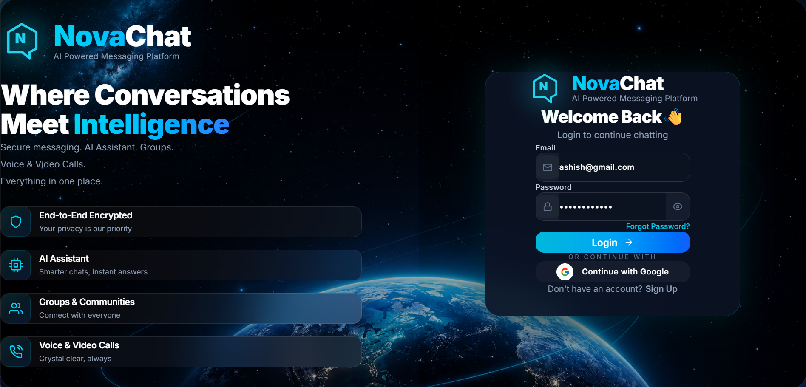
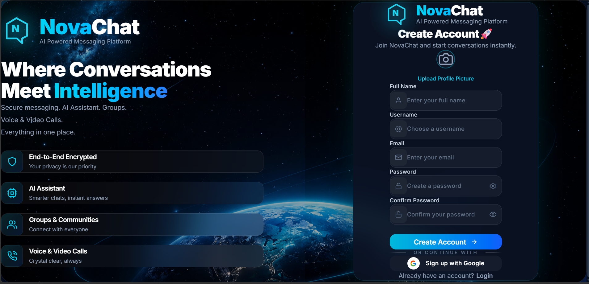
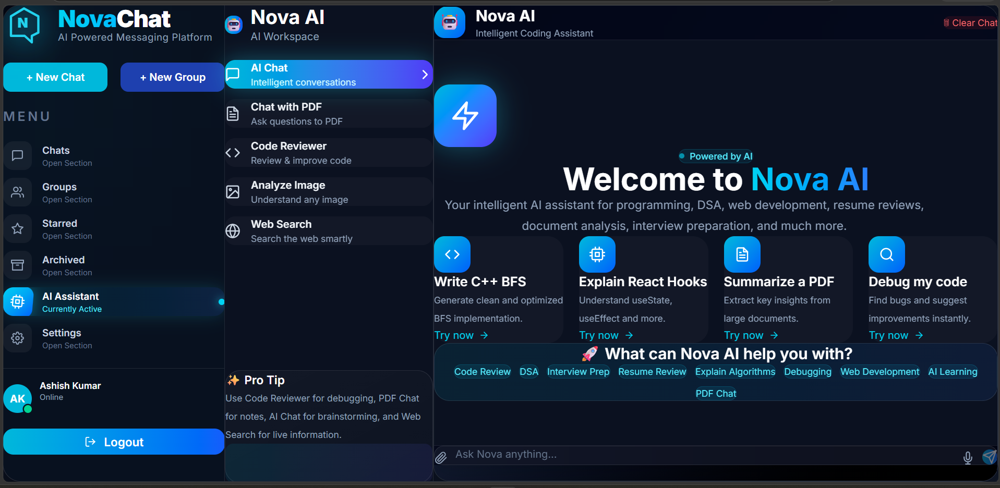
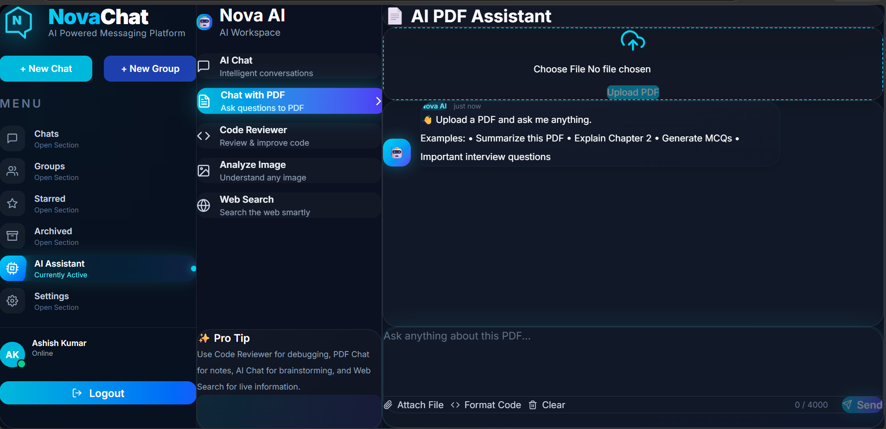

# 🚀 NovaChat — AI-Powered Real-Time Messaging Platform

<div align="center">


### Modern • Secure • Intelligent • Real-Time Messaging

Built with the **MERN Stack**, **Socket.IO**, and **Google Gemini AI**.


</div>

---

## 📖 Overview

**NovaChat** is a feature-rich real-time messaging platform that combines traditional chat functionality with AI-powered tools. Users can engage in private and group conversations while leveraging integrated AI features such as an AI Assistant, PDF Chat, and Code Reviewer—all within a modern, responsive interface.

---

# ✨ Features

## 💬 Messaging

- Real-Time One-to-One Chat
- Group Conversations
- Socket.IO Powered Messaging
- Online / Offline Status
- Typing Indicators
- Instant Message Delivery

## 👥 Groups

- Create Groups
- Multi-member Conversations
- Group Administration
- Group Chat Management

## ⭐ Chat Management

- Star Important Messages
- Archive Chats
- Pin Conversations
- Mute Chats
- Search Chats

## 🤖 AI Tools

- AI Assistant
- PDF Chat Assistant
- AI Code Reviewer

## 👤 User Management

- JWT Authentication
- Secure Login & Signup
- Profile Management
- Avatar Support
- Password Change
- Notification Settings
- Privacy Settings
- Appearance Settings

## 🎨 User Interface

- Modern Dark Theme
- Responsive Design
- Smooth Animations
- Glassmorphism Effects
- Beautiful Toast Notifications

---

# 🛠 Tech Stack

### Frontend

- React.js
- Redux Toolkit
- Tailwind CSS
- Framer Motion
- Axios
- React Router DOM
- React Icons
- Socket.IO Client

### Backend

- Node.js
- Express.js
- MongoDB
- Mongoose
- JWT Authentication
- Bcrypt
- Multer
- Socket.IO

### AI

- Google Gemini API

---

# 📂 Folder Structure

```text
NovaChat
│
├── client
│   ├── src
│   │   ├── components
│   │   ├── pages
│   │   ├── services
│   │   ├── slices
│   │   ├── assets
│   │   └── App.jsx
│
├── server
│   ├── controllers
│   ├── routes
│   ├── middleware
│   ├── models
│   ├── config
│   ├── socket
│   └── server.js
│
└── README.md
```

---

# 🚀 Installation

### Clone Repository

```bash
git clone https://github.com/YOUR_USERNAME/NovaChat.git
```

```bash
cd NovaChat
```

### Install Frontend

```bash
cd client
npm install
```

### Install Backend

```bash
cd ../server
npm install
```

---

# ⚙️ Environment Variables

Create a `.env` file inside the **server** directory.

```env
PORT=5000

MONGODB_URI=YOUR_MONGODB_URI

JWT_SECRET=YOUR_SECRET

GEMINI_API_KEY=YOUR_GEMINI_API_KEY

CLIENT_URL=http://localhost:3000
```

---

# ▶️ Run the Application

### Backend

```bash
npm run dev
```

### Frontend

```bash
npm start
```

---

## 🏗️ System Architecture

<p align="center">
  
</p>

---
---


## 🖥️ Platform Preview


<p align="center">
  
</p>
<p align="center">
  
</p>
<p align="center">
  
</p>
<p align="center">
  
</p>
<p align="center">
  
</p>

---
   
```
Home
Chat Window
Group Chat
Voice Call
Video Call
AI Assistant
PDF Chat
Code Reviewer
Settings
```

---

# 🚀 Future Improvements

- Message Scheduling
- Screen Sharing
- Chat Themes
- File Sharing

---

# 🤝 Contributing

Contributions are welcome!

```bash
git checkout -b feature-name
```

```bash
git commit -m "Add new feature"
```

```bash
git push origin feature-name
```

Open a Pull Request 🚀

---

# 📜 License

This project is licensed under the MIT License.

---

# 👨‍💻 Developer

**Jyoti Ranjan**

- MERN Stack Developer
- AI Enthusiast
- Open Source Learner

---

<div align="center">

### ⭐ If you like this project, don't forget to star the repository!

Made with ❤️ using React, Node.js, MongoDB & Socket.IO

</div>
